Snake for DOS
=============

A simple game inspired to the one delivered with old Nokia phones.

A few notes
-----------

 * This is the very first program I wrote. :)
 * It is written in C and contains a huge do-while (about 370 lines of code).
 * Memory-mapped I/O is used to print to screen. I thought it was so cooool.
 * It has been build and executed on Windows XP Professional 32 bit using Borland C++ 3.1.
 * The program is actually not portable. It doesn't even run on a modern Windows machine. I didn't care at all, back then.

Screenshots
-----------

Main Menu:

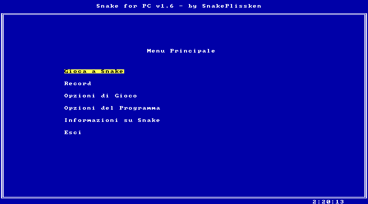

Start a game:

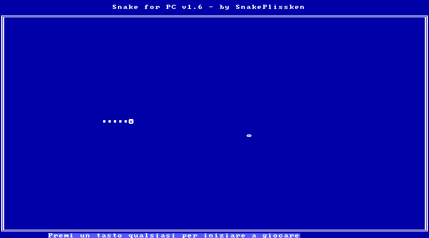

Playing:

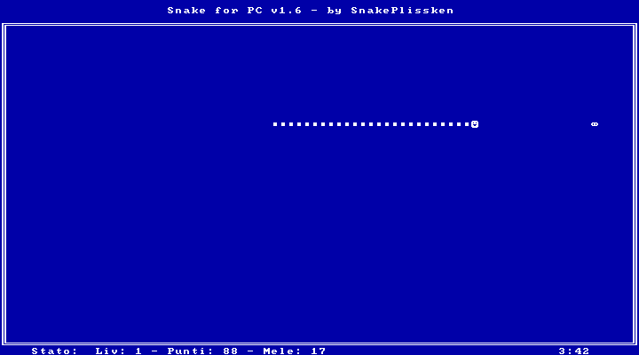

Suspend and save current game:

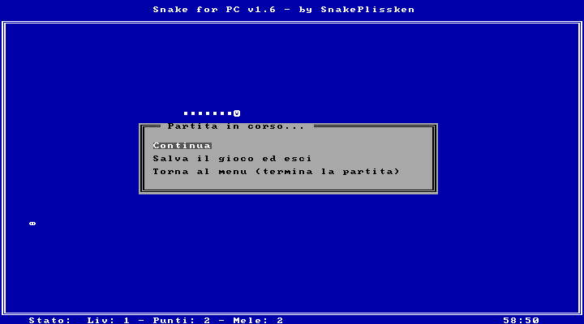

Extra points:

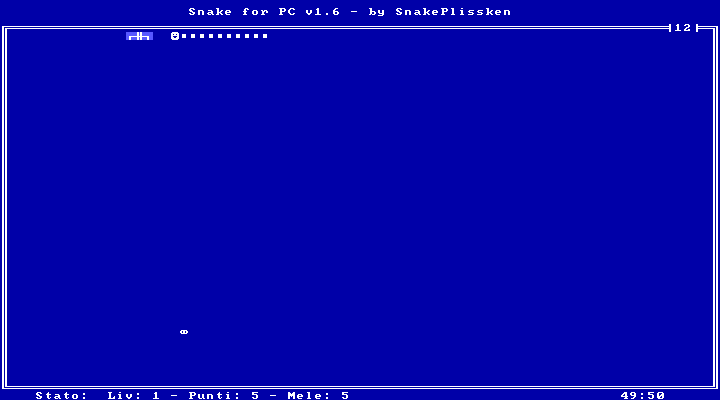

Game over!

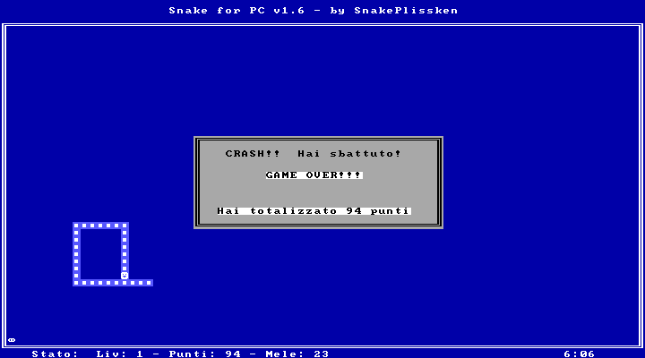

New record:

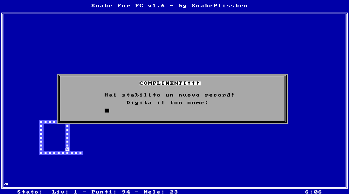

Congrats!

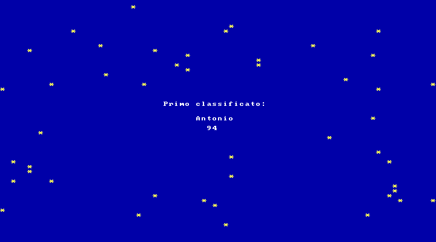

Record list:

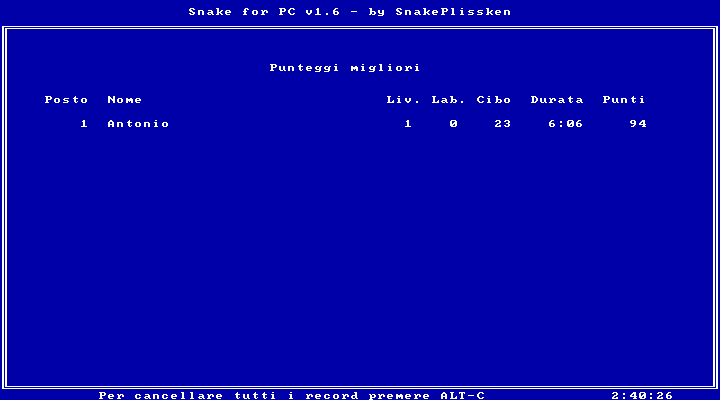

Game options:

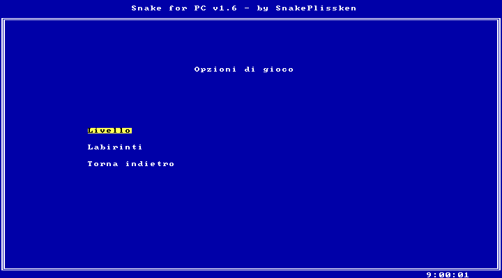

Game options - Level:

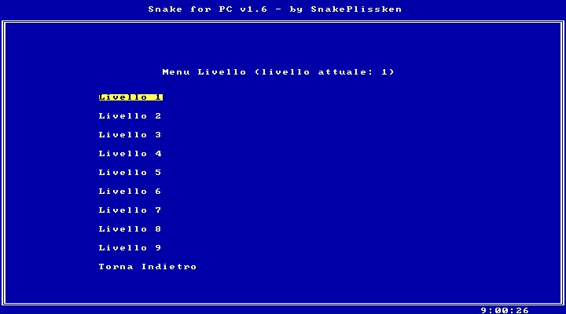

Game options - Mazes:

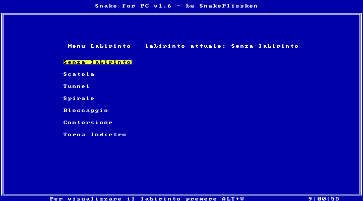

Game options - Mazes - Spiral:

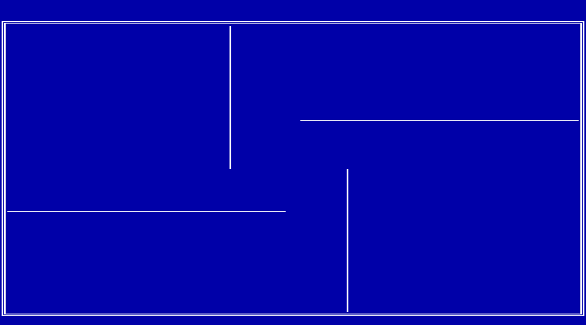

Program options:

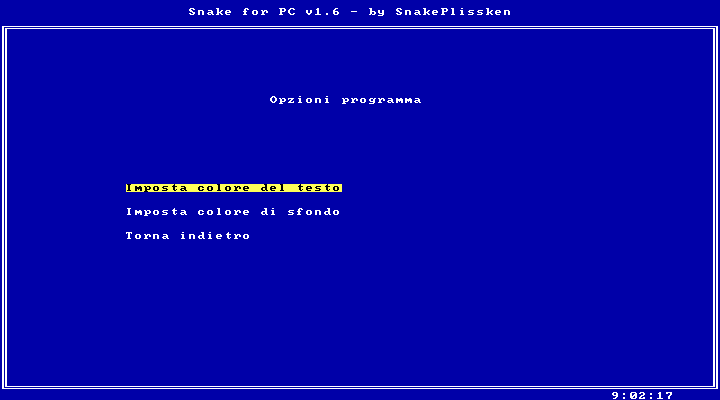

Program options - Set foreground color:

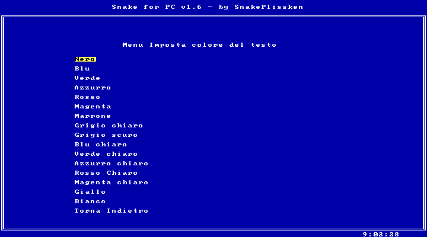

Program options - Set background color:

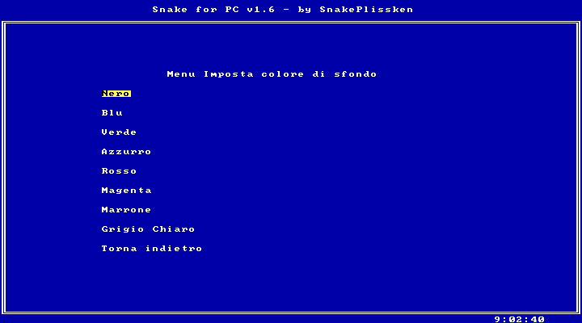

Program info:

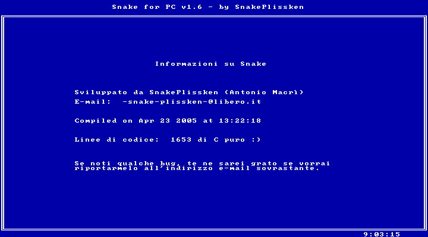
